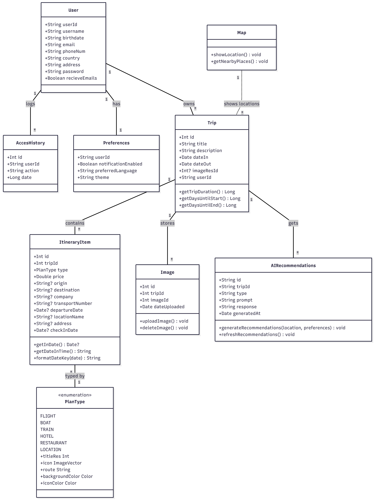

# 📐 Architectural Design — Monarca Smart Travel

## 🏛️ General Architecture

Monarca Smart Travel follows an **MVVM (Model-View-ViewModel)** architecture for better separation of concerns and scalability.

- **`ui/`** — Contains all screens and visual components (View). Built entirely with **Jetpack Compose** and the **Material 3** design system, with support for both light and dark mode. Reusable components such as `MyTopBar`, `MyBottomBar`, `TripCard` and `PopUp` are centralised in `MainLayout.kt`.
- **`domain/`** — Contains data models and business logic (Model). This layer is completely framework-independent, which facilitates testing and future integration with real repositories.

Navigation is managed with **Jetpack Navigation Compose** from `MainActivity`, using a single `NavHost` that centralises all routes. The main screens are grouped into three sections accessible from the bottom navigation bar: **Home**, **Trips** and **Preferences**.

## 📊 Data Model: Designed in full for future Sprints

The domain model has been designed with scalability in mind. All classes include business functions annotated with `@TODO` to be implemented in later sprints, following the contract defined from the very first sprint.

The key design decisions are:
- **Expanded `User` profile and `AccesHistory` Auditing** — The `Authentication` class has been removed and its fields unified directly within the `User` class, which now holds a much richer profile (`username`, `birthdate`, `phoneNum`, `country`, `address`, and `recieveEmails`). A new `AccesHistory` entity has been introduced to keep an auditable, timestamped log of user actions.
- **Flexible `Trip` structure** — The concept of a trip has been broadened. Instead of a single `destination` string, trips now use a `title` and a `description`, allowing for better customisation.
- **Unified `ItineraryItem`** — a single class with optional fields covers all plan types (transport and accommodation), simplifying future persistence.
- **`PlanType` as an enum with metadata** — each plan type carries its icon, colours and route, avoiding scattered mapping tables in the UI.
- **`AIRecommendations`** — prepared from Sprint 01 to anticipate the product's AI feature.

